# Лабораторна робота №4

## Тема: "Створення сценарію terraform для надання інфраструктури в хмарі GCP (або AWS)"

Виконала студентка 3 курсу

Напрям "ІПЗ" група 1.2

Копчак Ірина Сергіївна

### План:
1. Створіть один екземпляр (зображення: ubuntu 20.04)

Cпочатку я встановила Terraform на убунту:

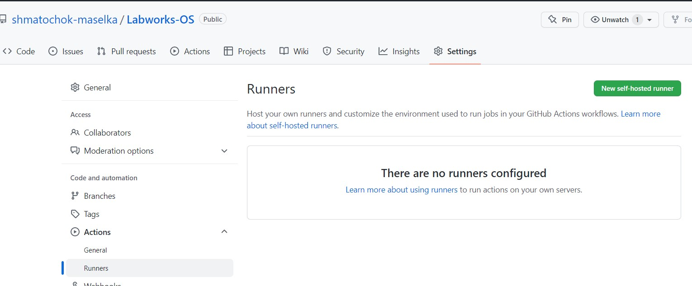

Потім зареєструвалась на AWS, створила там групу юзерів з правами адміністратора та створила користувача у ній.
Після чого отримала для цього користувача access_key i secret_key для того, щоб у подальшому використати їх у файлі main.tf.

Далі я створила файл main.tf для прописування конфігурації образу убунти, щоб за допомогою Тераформу розмістити
її на AWS.

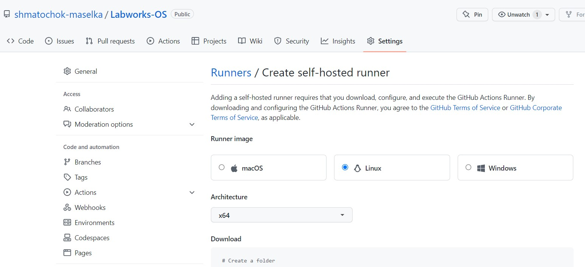

Потім виконала команди terraform init(деплой інстансу на AWS), terraform plan(які зміни відбудуться після аплаю файлу), terraform apply(власне розміщення на AWS):

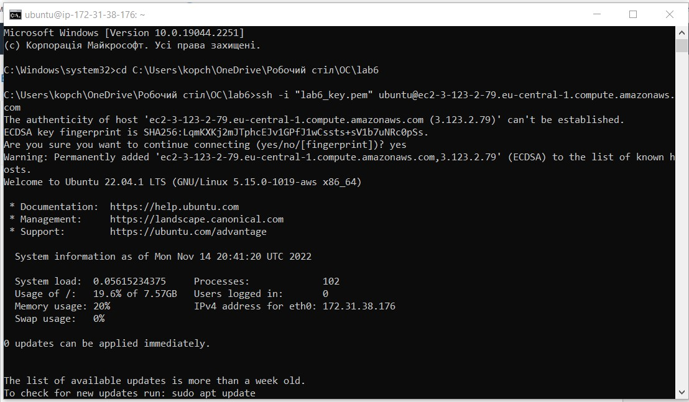
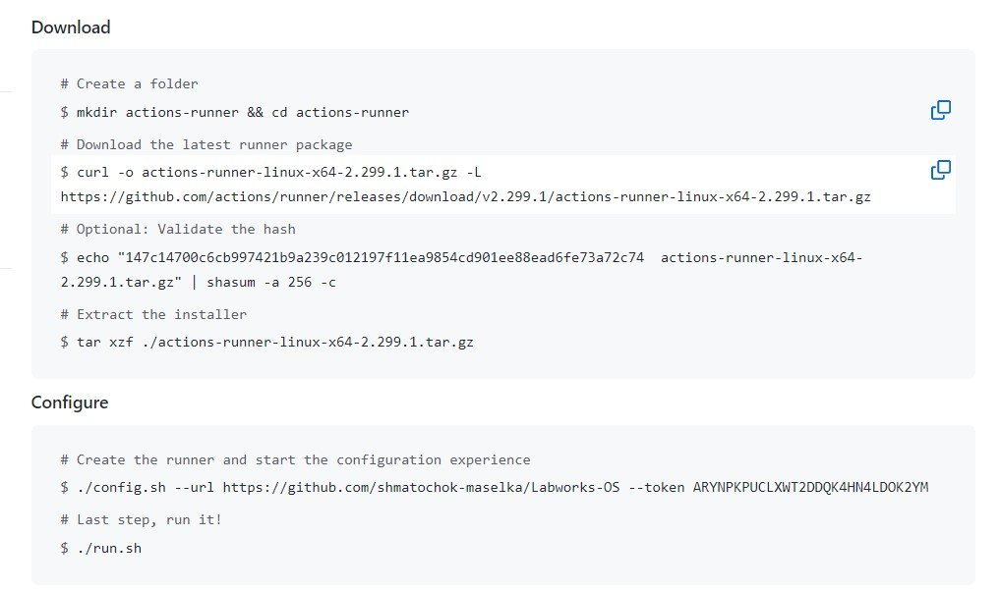
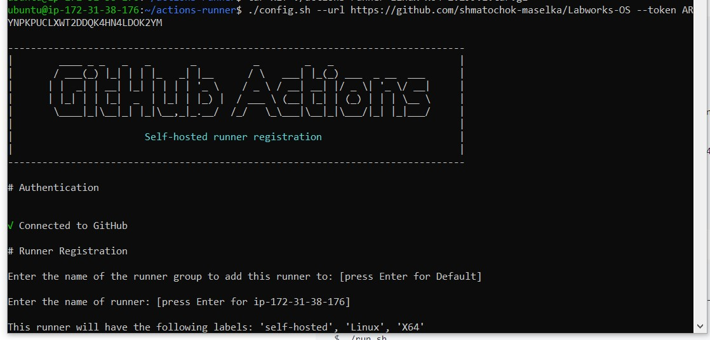
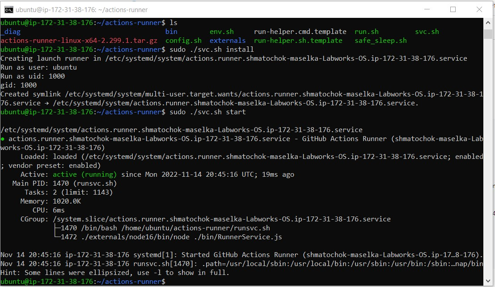


Вигляд інстансу у AWS:

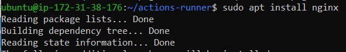

2. Дозвольте трафік HTTP/HTTPS на мережевому адаптері
Прописую відповідні дозволи у файлі main.tf:
```
#securitygroup using Terraform

resource "aws_security_group" "TF_SG" {
  name        = "security group using Terraform"
  description = "security group using Terraform"
  vpc_id      = "vpc-0102c55ada6f6c220"

  ingress {
    description      = "HTTPS"
    from_port        = 443
    to_port          = 443
    protocol         = "tcp"
    cidr_blocks      = ["0.0.0.0/0"]
    ipv6_cidr_blocks = ["::/0"]
  }

  ingress {
    description      = "HTTP"
    from_port        = 80
    to_port          = 80
    protocol         = "tcp"
    cidr_blocks      = ["0.0.0.0/0"]
    ipv6_cidr_blocks = ["::/0"]
  }
  egress {
    from_port        = 0
    to_port          = 0
    protocol         = "-1"
    cidr_blocks      = ["0.0.0.0/0"]
    ipv6_cidr_blocks = ["::/0"]
  }

  tags = {
    Name = "TF_SG"
  }
}
```
Вигляд доданої security group y AWS:


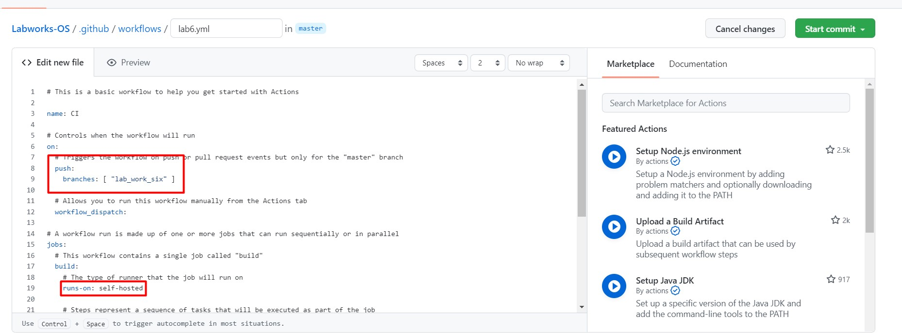

Дивимось на наш інстанс у AWS:

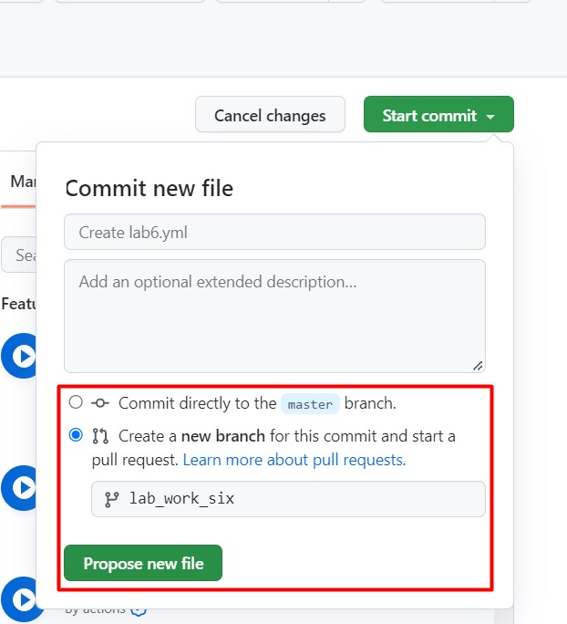

Як бачимо, змін security group з дефолтної на створену мною не відбулось. Це тому, що вона не була прописана як security group
безпосередньо для цього інстансу. Тож виправимо це:

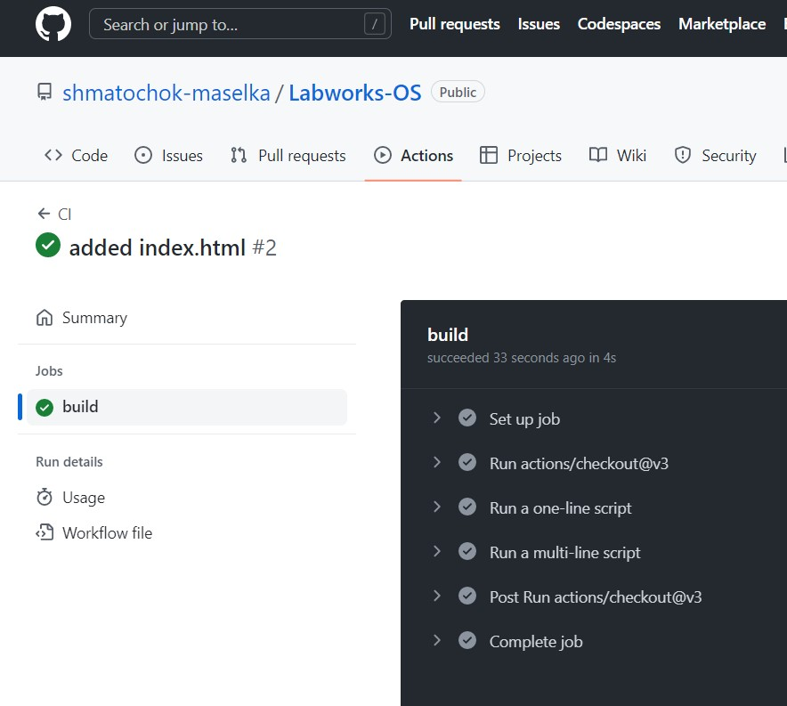

Результат:


3. Надайте один відкритий ключ SSH для створеного екземпляра

Спочатку згенерую приватний та паблік ssh-ключі за допомогою наступної команди:

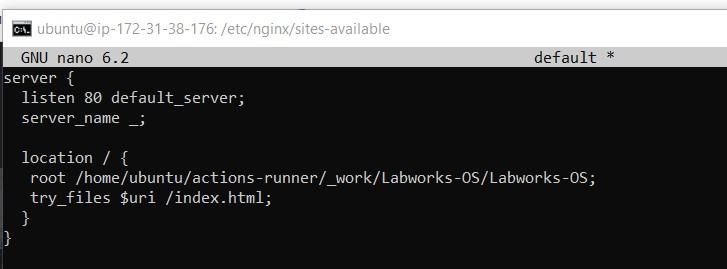

Додаю наступне у main.tf:


Далі потрібно додати ключ у resource:

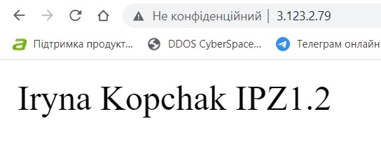

4. Встановіть веб-сервер (HTTP-сервер Apache / HTTP-сервер NGINX) за сценарієм bash

script.sh:
```
sudo apt update
sudo apt upgrade
sudo apt install apache2
sudo systemctl start apache2
sudo systemctl enable apache2
```

Далі переходжу на сайт, щоб знайти приклад підключення до цього інстансу за допомогою ssh:

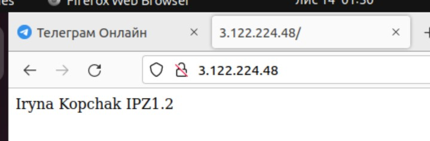

Як бачимо, на даному етапі це є неможливим, адже у мене закритий 22 порт. Виправляю ситуацію за допомогою додавання
наступного у main.tf:


Тепер 22 порт відкритий і є можливість виконати наступну команду:


Створення, зміна місця знаходження та заповнення файлу index.html:


Відкриваю цей файл:


