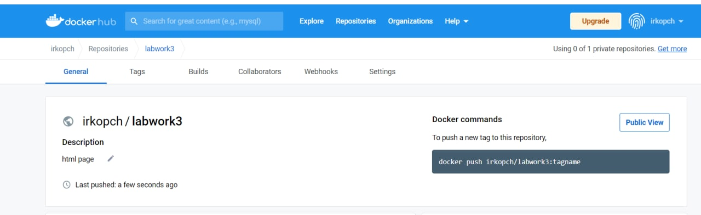
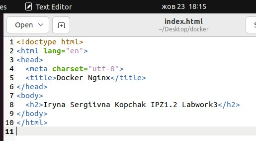

# Лабораторна робота №

## Тема: "Docker"

Виконала студентка 3 курсу
Напрям "ІПЗ" група 1.2
Копчак Ірина Сергіївна

### План:
1) Використання готових Docker Images.
2) Використання Docker Compose.
3) Створення HTML сторінки та занесення її в Docker Image. Залити даний Docker Image на Docker Hub.
4) Скачати Docker Image когось із групи і розвернути в себе контейнер з HTML сторінкою на порті 8086 ззовні.

### Завдання 1.
#### Використання готових Docker Images.
Я створила папку «docker» на робочому столі і у ній створила файл docker-compose.yml з наступним вмістом:

### Завдання 2.
#### Використання Docker Compose.
Docker Compose — інструментальний засіб, що входить до складу Docker. Він призначений для вирішення завдань, пов'язаних із розгортанням проектів: Docker Compose використовується для одночасного керування кількома контейнерами, що входять до складу програми. Цей інструмент пропонує ті ж можливості, що й Docker, але дозволяє працювати з більш складними програмами.
Для налаштування служб програми у Docker Compose використовується конфігураційний файл з розширенням .yml. Тобто спочатку створюється файл YAML, де будуть прописані налаштування служб, а після цього за допомогою команди docker compose -d створюються та запускаються всі служби з нього.  

YAML — зручний для читання людиною формат серіалізації даних, концептуально близький до мов розмітки; у Docker Compose використовується для налаштування служб програм.  

#### Переваги YAML:
1. YAML короткий і зрозумілий, легко читається та пишеться;
2. YAML використовує структури даних, характерні для мов програмування;
3. cинтаксис YAML мінімальний у порівнянні з XML;
4. підтримує коментарі на відмінно від JSON;
5. підтримує рядки без лапок.

#### Недоліки YAML:
1. Строгість у відступах: якщо ви неправильно вставите один пробіл під час відступу, код може перестати працювати.
2. Легше знайти підтримку XML, JSON замість YAML.
3. JSON і XML мають кращу продуктивність, ніж YAML.  

Приклад створення та збирання образа за допомогою Docker Compose - виконання завдання 1.
### Завдання 3.
#### Створення HTML сторінки та занесення її в Docker Image. Залити даний Docker Image на Docker Hub.
Спочатку я створила репозиторій «labwork3» на DockerHub:

Потім зайшла у свій акаунт за допомогою команди docker login; створила тег, який показує на мій image та запушила його на репозиторій:

Вигляд репозиторію після push:

HTML-файл:

### Завдання 4.
#### Скачати Docker Image когось із групи і розвернути в себе контейнер з HTML сторінкою на порті 8086 ззовні.
Для виконання цього завдання я скачаю Docker Image мого однокурсника Сергія Миколайовича Оліярника - [Посилання на роботу Сергія](https://hub.docker.com/r/sergoliarnik/my_page).  

Стягую його Docker Image:

Розгортаю його Docker Image у себе на порті 8086:

Отримана html-сторінка Сергія Миколайовича Оліярника:

### [Мій репозиторій на DockerHub](https://hub.docker.com/r/irkopch/labwork3)
#### Висновок: на цій лабораторній роботі я навчилась працювати з Docker Image, Docker Compose та репозиторіями на DockerHub(виконувала з ними операції створення, push та pull).
